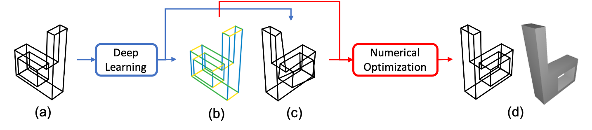

<h1>Deep Learning Assisted Optimization for 3D Reconstruction from Single 2D Line Drawings</h1>

<h3>
  <a href='https://bertjiazheng.github.io/' target='_blank'>Jia Zheng</a>
  ·
  <a href='https://stevenzzz07.github.io/' target='_blank'>Yifan Zhu</a>
  ·
  <a href='https://jason-khan.github.io/' target='_blank'>Kehan Wang</a>
  ·
  <a href='https://qiang-zou.github.io/' target='_blank'>Qiang Zou</a>
  ·
  <a href='https://zihan-z.github.io/' target='_blank'>Zihan Zhou</a>
</h3>

<h3>
  <a href="https://manycore-research.github.io/cstr" target='_blank'>[Project Page]</a>
  ·
  <a href="https://arxiv.org/abs/2207.xxxxx" target='_blank'>[Paper]</a>
</h3>

